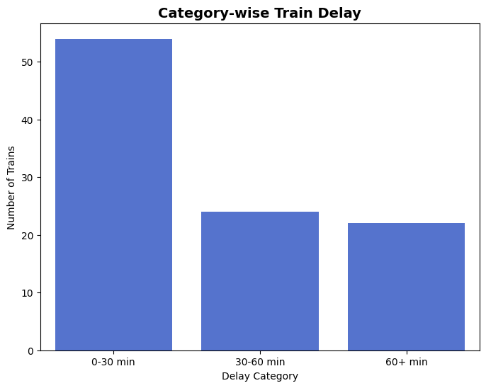
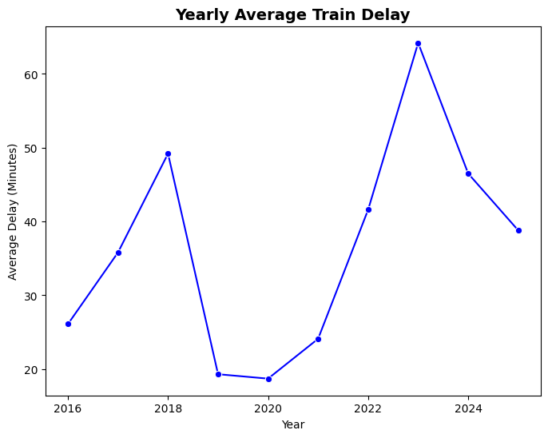
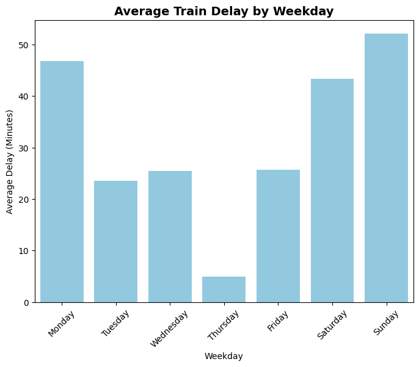
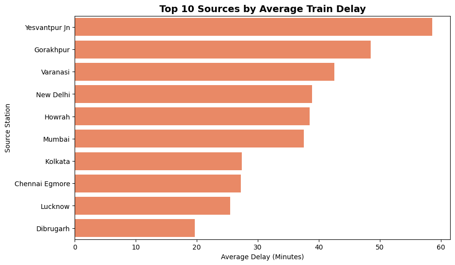

# project_train_delay 

This project provides a comprehensive analysis of train delays using historical data. Interactive dashboards and visualizations help understand patterns and identify problem areas for operational improvements.

---

## 📝 Key Insights

### 1️⃣ Delay Distribution
- **0–30 min:** Most trains face minor delays (operationally acceptable).  
- **30–60 min:** Moderate delays → noticeable impact.  
- **60+ min:** Few trains face high delays → focus area.  
- **Insight:** Majority of trains have small delays, extreme delays are rare.

  
*Figure: Category-wise Delay Distribution*

---

### 2️⃣ Yearly Trend
- Average train delay trends over the years indicate periods of increase or decrease.  
- **Insight:** Identifies years with unusual spikes for investigation.

  
*Figure: Yearly Average Train Delay*

---

### 3️⃣ Weekday Trend
- Certain weekdays (e.g., Friday & Saturday) have higher average delays.  
- **Insight:** Specific days require operational focus.

  
*Figure: Weekday-wise Average Delay*

---

### 4️⃣ Source → Destination Heatmap
- Top 10 sources & destinations with highest delays highlighted in heatmap.  
- **Insight:** Routes needing schedule review or operational improvement.

  
*Figure: Interactive Heatmap with Year + Week Dropdown*

> You can explore the interactive heatmap directly in the notebook.

---

### 5️⃣ Most Frequent / High Delay Trains
- Frequent trains and consistently late trains identified.  
- **Insight:** Focus on improving punctuality for these trains.

  
*Figure: Top 10 Frequent / High Delay Trains*

---

## 📊 Interactive Dashboard Features
- **Category-wise Delay:** 0–30, 30–60, 60+ min  
- **Yearly Trend:** Line chart showing average delay per year  
- **Weekday Trend:** Bar chart for average delay per weekday  
- **Source → Destination Heatmap:** Interactive, with **Year + Week dropdown**  
- Hover to see exact average delays, zoom/pan available.

---

## 💡 Usage / How to Explore
1. Explore **distribution charts** first → see where most trains fall.  
2. Use **yearly & weekday trends** → understand when delays occur.  
3. Check **top routes & trains** → find problem areas.  
4. Use **interactive heatmap** → select any year & week to analyze route delays.

---

## 🔧 Tech Stack
- Python, Pandas, Matplotlib, Seaborn  
- Plotly for interactive dashboards  

---

## ✅ Conclusion
- Most delays are minor.  
- Specific trains/routes & weekdays require attention.  
- Dashboard allows detailed exploration and operational planning.

---

## 📈 Skills Demonstrated  

- **Data Wrangling** → handling missing values, inconsistent datetime formats  
- **Feature Engineering** → calculating `Calc_delay_min`, `Delay_Category`, weekday, month  
- **Exploratory Data Analysis (EDA)** → trends across years, weekdays, categories  
- **Data Visualization** → histograms, KDE, bar charts, line charts, scatter plots  
- **Project Structuring** → followed professional folder structure  

---

## ✅ Conclusion  

- Majority of trains are delayed by **small margins (0–30 mins)**  
- But long delays (60+ mins) remain a challenge  
- Delay patterns depend on **year, weekday, and routes**  
- Insights like these can help **Indian Railways improve punctuality**  

---

## 🚀 Future Improvements  

- Build a **Machine Learning model** to predict train delays  
- Create an **interactive dashboard** (Streamlit / Power BI)  
- Deploy as a **web app** for real-time delay tracking  

---

## 👨‍💻 About Me  

Hi, I’m **Atharv Mhargude** – a 3rd-year Engineering student passionate about **Data Analytics, Python, and Machine Learning**.  
I enjoy solving real-world problems with data and creating impactful insights.  

🔗 [LinkedIn](https://www.linkedin.com/in/atharv-mhargude-b923b82a5/) | ✉️ atharvmx07@gmail.com  

---

✨ *If you’re looking for someone who can turn raw data into actionable insights → Let’s connect!* ✨  

